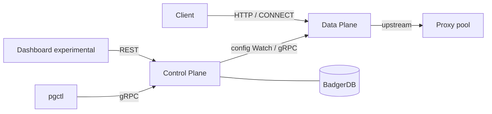
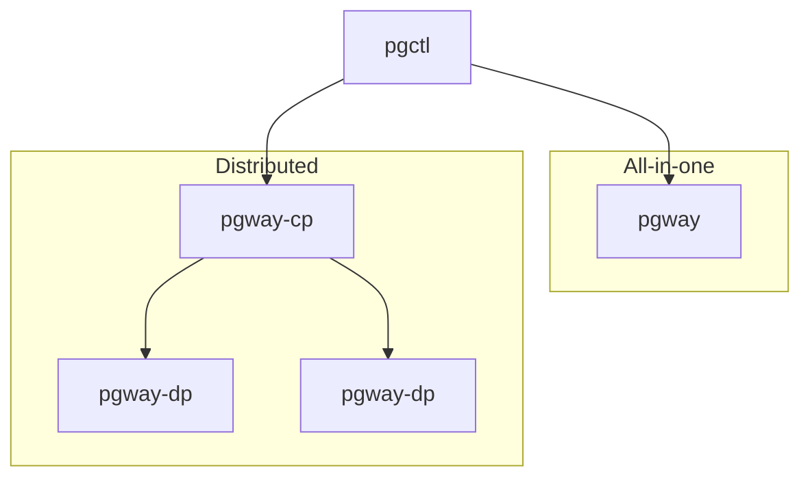

# Concepts — Binaries & planes

pgway splits **configuration** from **traffic**. The **Control Plane (CP)** stores and serves config; the **Data Plane (DP)** listens on entrypoints and forwards requests through pools. You can run both in one process or as separate binaries.

## Control Plane responsibilities

The CP is the source of truth for resources (Proxy, Pool, LoadBalancer, Router, Flow, Entrypoint, users, agents).

- Persist config in **BadgerDB**
- Expose **gRPC** (primary API for `pgctl` and agents) and **REST** (dashboard; experimental)
- Authenticate users (bootstrap / login tokens) and **agents** (registration + per-agent tokens)
- Emit config change events so DPs can **hot-reload** without a full restart
- Track agent registry (heartbeat → active / passive / disconnected)

The CP does **not** terminate client proxy traffic. It does not dial upstream proxies on the hot path.

## Data Plane responsibilities

The DP is the gateway runtime.

- Bind **entrypoints** and accept HTTP / CONNECT
- Execute the flow: router (if any) → load balancer → pool → upstream proxy
- Keep an in-memory view of config for the hot path (not a live DB read per request)
- In distributed mode: **register** with the CP, **heartbeat**, subscribe to **Watch** / config updates
- Report balancer feedback (e.g. downstream bytes for `least-bytes`) via the in-process balancer API

The DP does **not** own durable config. Applying YAML always goes to the CP (directly or via `pgctl`).

## Deployment modes

| Mode | How it runs | When to use |
|------|-------------|-------------|
| **All-in-one** | One process hosts CP + DP | Local dev, simple self-host |
| **Distributed** | `pgway-cp` + one or more `pgway-dp` agents | Separate config host from edge gateways |

In all-in-one mode, CP and DP share memory: apply → event → in-process reload. In distributed mode, each DP dials the CP over gRPC with agent credentials and receives updates over the agent stream.

## Binaries

| Binary | Plane | Role |
|--------|-------|------|
| **`pgway`** | CP + DP | All-in-one server: BadgerDB, gRPC/REST, and local entrypoints |
| **`pgway-cp`** | CP only | Standalone control plane (storage + APIs, no client traffic) |
| **`pgway-dp`** | DP only | Standalone gateway agent; dials CP, serves entrypoints |
| **`pgctl`** | Client | CLI to apply / get / delete resources and manage users & agents |

### `pgway`

Default path for trying the project: one binary, one config file, local entrypoints. Still speaks gRPC for `pgctl` and can expose REST for the experimental dashboard.

### `pgway-cp`

Run when you want a dedicated config service. Holds BadgerDB, auth, agent registry, and APIs. Scale or place edge listeners elsewhere via `pgway-dp`.

### `pgway-dp`

Edge (or colocated) gateway. Needs CP reachability (`grpc_listen_addr`), an **agent identity** (`agent_name`, labels), and either:

1. A one-time **registration token** (`PGWAY_REGISTRATION_TOKEN` / `pgctl agent token create`), or  
2. Persisted credentials at `agent_state_path` from a previous register

After register, the DP heartbeats and watches for config changes. Stopping the process deregisters to a passive state; deleting the agent on the CP revokes credentials.

### `pgctl`

Operator tool — not a server. Talks to the CP over gRPC with a user token (`pgctl init` / `login`). Typical flow: `apply -f stack.yaml`, `get …`, agent and user management. It never proxies client HTTP traffic.

## What each plane does *not* do

| | Control Plane | Data Plane |
|--|---------------|------------|
| Store durable config | Yes | No |
| Serve `:entrypoint` traffic | No | Yes |
| Run balancer algorithms | No (config only) | Yes |
| Issue user / agent tokens | Yes | No (consumes agent token) |
| Dashboard / REST | Yes (experimental) | No |

## Related

- [Resources & flow model](resources.md) — what gets configured
- [Installation](../getting-started/installation.md) — build from source
- [Configuration](../getting-started/configuration.md) — config file and keys
- [First run](../getting-started/first-run.md) — bootstrap and first apply
