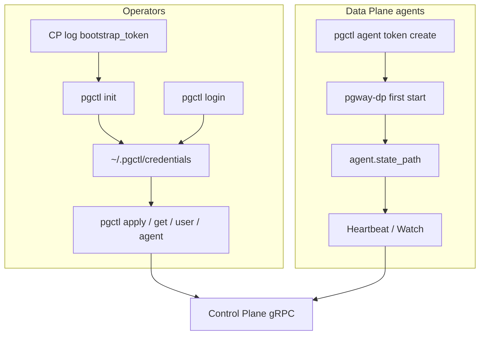

# Authentication

pgway’s Control Plane authenticates **operators** (users / `pgctl`) and, in distributed mode, **agents** (`pgway-dp`). These use different tokens — do not mix them up.



Hands-on bootstrap: [First run](../getting-started/first-run.md). Config TTLs: [Configuration](../getting-started/configuration.md). Planes: [Binaries & planes](../concepts/binaries.md).

## gRPC vs REST

| Surface | Auth today |
|---------|------------|
| **gRPC** (primary) | Bearer token on almost every RPC |
| **REST** (dashboard) | **Not enforced yet** — experimental; do not expose publicly |

gRPC RPCs that do **not** require a prior user/agent session:

| RPC | Purpose |
|-----|---------|
| `AuthService/InitAdmin` | First admin via bootstrap token |
| `AuthService/Login` | Exchange username/password for a session token |
| `AgentService/Register` | First-time agent join via registration token |

Everything else (apply, get, user admin, agent list/delete, Watch after register, …) needs a valid bearer.

## Token cheat-sheet

| Token | Who creates it | Who consumes it | Lifetime |
|-------|----------------|-----------------|----------|
| **Bootstrap token** | CP log when **no users** exist | `pgctl init` | One-shot; new value if you restart before init |
| **User session token** | `pgctl init` / `pgctl login` | `pgctl` → CP | Default `token_ttl` (e.g. `720h`); optional `--no-expiry` |
| **Agent registration token** | `pgctl agent token create` | `pgway-dp` **first** Register | Single-use; default TTL `auth.registration_token_ttl` |
| **Agent token** | Issued at Register | `pgway-dp` (persisted) | Sliding `agent_token_ttl`; extended on heartbeat |

!!! note "All-in-one"
    `pgway` (CP+DP in one process) still needs the **bootstrap** / user session path for `pgctl`. It does **not** need agent registration tokens — there is no separate agent process.

## Operators (users)

### Bootstrap (empty install)

1. Start `pgway` or `pgway-cp` with empty Badger user store.
2. Read `bootstrap_token` from the warn log line.
3. Run:

```bash
./build/pgctl init --bootstrap-token '<token-from-log>'
```

Creates the first **admin**, issues a session token, writes `~/.pgctl/credentials`.

!!! warning
    Restarting the CP **before** init generates a **new** bootstrap token. The old one is useless.

### Login / logout

```bash
./build/pgctl login --username admin              # default TTL
./build/pgctl login --username alice --no-expiry  # automation
./build/pgctl logout                              # revoke current token
```

### How `pgctl` picks a token

Highest wins:

1. `--token` flag  
2. `PGWAY_TOKEN` env / `token` in config file  
3. `~/.pgctl/credentials` (from `init` / `login`)

CLI state (`~/.pgctl/`) is separate from shared config search paths (`~/.pgway/`, `/etc/pgway/`, `.`).

### Users

Passwords are stored **bcrypt-hashed**. Changing a password **revokes all** of that user’s session tokens.

```bash
./build/pgctl user create bob                 # admin; prints one-time temporary password
./build/pgctl user create alice --role admin
./build/pgctl user list                       # admin
./build/pgctl user change-password            # own password
./build/pgctl user change-password bob        # admin reset
./build/pgctl user delete bob                 # admin; last admin cannot be deleted
```

## Agents (`pgway-dp`)

Standalone Data Planes do **not** use user login. They authenticate with an **agent token** obtained via registration.

### First start

```bash
# on a machine with pgctl logged in as admin
./build/pgctl agent token create
# → single-use registration token

PGWAY_AGENT_REGISTRATION_TOKEN='<registration-token>' \
  ./build/pgway-dp --config ./dp.toml
```

`dp.toml` must dial the CP (`grpc.listen_addr`) and set at least `agent.name` / `agent.state_path` (see [Configuration](../getting-started/configuration.md)).

On success, Register returns credentials written to `agent.state_path` (`{agent_id, agent_token}`; directory mode `0700`, file `0600`).

### Later starts

Reuse `agent.state_path` — **no** registration token:

```bash
./build/pgway-dp --config ./dp.toml
```

Heartbeats (interval `heartbeat_interval`) extend the sliding agent token TTL. Status on the CP:

| Status | Meaning (approx.) |
|--------|-------------------|
| **active** | Heartbeat within `agent_heartbeat_threshold` |
| **passive** | Graceful deregister (clean shutdown) |
| **disconnected** | Missed heartbeats / stale |

```bash
./build/pgctl agent list
./build/pgctl agent delete <name>   # revoke credentials + remove registry row
```

After delete (or expired token without heartbeats), the DP needs a **new** registration token to join again.

## Related config keys

| Key | Role |
|-----|------|
| `token_ttl` | Default user session lifetime |
| `auth.registration_token_ttl` | Default agent registration token TTL |
| `agent_token_ttl` | Sliding agent bearer lifetime |
| `agent_heartbeat_threshold` | Active vs disconnected boundary |
| `heartbeat_interval` | DP heartbeat period |
| `agent.state_path` | Persisted agent credentials |
| `agent.registration_token` / `PGWAY_AGENT_REGISTRATION_TOKEN` | First Register only |

## Security notes

- Treat bootstrap, registration, and session tokens as secrets.
- Prefer env vars for secrets (`PGWAY_TOKEN`, `PGWAY_AGENT_REGISTRATION_TOKEN`) over committing them in YAML.
- Do not expose unauthenticated REST / dashboard ports on untrusted networks.
- mTLS between CP and DP is planned ([#47](https://github.com/aknEvrnky/pgway/issues/47)), not implemented yet.
