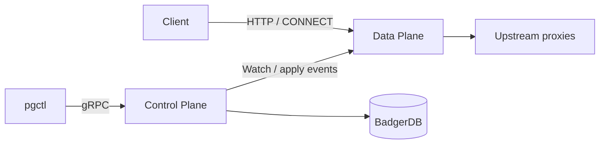

# Contributing

This page is for people changing **pgway** (and optionally these docs). It complements the repo’s [`CONTRIBUTING.md`](https://github.com/aknEvrnky/pgway/blob/main/CONTRIBUTING.md) with architecture context and pitfalls.

!!! tip "Two repositories"
    - **Code:** [aknEvrnky/pgway](https://github.com/aknEvrnky/pgway)
    - **Docs (this site):** [aknEvrnky/pgway-docs](https://github.com/aknEvrnky/pgway-docs)

    User-facing changes (schema, binaries, auth, install, guides) should update **both** when needed. Local notes under `pgway/docs/` (if present) are not published.

## Architecture you must respect

pgway is **hexagonal** (ports & adapters) and split into **Control Plane (CP)** and **Data Plane (DP)**.



| Concern | Owns | Does not |
|---------|------|----------|
| **CP** | Durable config, auth, agents, apply/delete, change events | Client traffic, dialing upstreams on the hot path |
| **DP** | Entrypoints, routing, balancers, proxying, in-memory hot path | Owning the source of truth in Badger |

Binaries: `pgway` (both), `pgway-cp`, `pgway-dp`, `pgctl`. See [Binaries & planes](../concepts/binaries.md).

### Go package map

| Area | Packages |
|------|----------|
| Shared domain | `internal/application/core/domain` |
| Control plane | `internal/application/controlplane`, `auth`, `agent` |
| Data plane | `internal/application/dataplane/{api,agenthost,balancer,consumer}` |
| Ports | `internal/ports` |
| Adapters | `internal/adapters/{grpc,http,rest,cli,repository/badger,...}` |
| Wiring | `cmd/pgway`, `cmd/pgway-cp`, `cmd/pgway-dp`, `cmd/pgctl` |

**Import rules (enforced by tests):**

- `core/domain` — no imports from other `internal/` packages
- `dataplane/*` must **not** import `controlplane`, `auth`, or `agent`
- `ports` may import `core/domain` from application (schema types on Apply writers are an intentional CP-edge exception)
- Only `cmd/pgway` wires CP + DP in one process

## What to watch for

### Plane boundaries

- New hot-path / listen / balancer logic → **dataplane**
- New apply/CRUD / persistence / user-agent token logic → **controlplane** (or `auth` / `agent`)
- Do not “reach through” with a concrete CP service from DP packages; use **ports** (`ControlPlaneReader`, `ProxyResolver`, …)

### Hexagonal habits

- Define or extend an interface in `ports/` before writing an adapter
- Keep adapters thin (proto/YAML ↔ domain mapping); business rules stay in application/domain
- Inject dependencies in constructors; wire in `cmd/*/main.go`

### Config and events

- Durable writes go to Badger via CP; DP learns through bootstrap + **change events** / Watch
- Events are thin hints (id + resource type + kind) — handlers reload what they need
- Balancer runtime state (RR cursor, least-bytes counters, …) resets when that balancer instance is rebuilt

### Schema / proto / CLI

- YAML Apply specs live under `internal/schema/...`
- gRPC contracts under `proto/`; after edits run `make proto` and commit `gen/`
- Prefer documenting new fields in [Resource reference](../reference/index.md)

### Testing and CI

```bash
make tools     # gotestsum + protoc-gen-go / protoc-gen-go-grpc (needs system protoc)
make test      # gotestsum + -race
go vet ./...
make proto     # if .proto changed — CI checks gen/ drift
```

Cover new behavior with unit tests next to the code and/or `integration/` tests. Table-driven tests with `testify` are the project norm.

### Docs and DX

- Update this MkDocs site when operators need to know (install Go version, resource fields, guides)
- Dashboard / REST is **experimental** — do not block core gateway correctness on UI polish
- Do **not** commit editor or agent tooling (`.cursor/`, `.claude/`, `CLAUDE.md`) into the code repo

## Suggested workflow

1. Open an issue (bug/feature templates in the code repo) when the change is non-trivial.
2. Implement on a branch; keep PRs focused. Use **Conventional Commits** (`feat:`, `fix:`, `docs:`, …) so GoReleaser can group release notes — see the code repo [`CONTRIBUTING.md`](https://github.com/aknEvrnky/pgway/blob/main/CONTRIBUTING.md).
3. Run `make test` / `go vet` (and `make proto` if needed).
4. Update **pgway-docs** in a matching change when the user-facing surface moved (same commit style in this repo).
5. Open a PR using the template; link issues and note docs PRs.

## License

The project is licensed under [Apache License 2.0](https://github.com/aknEvrnky/pgway/blob/main/LICENSE). Contributions are expected under the same terms.

## Related

- [Resources & flow model](../concepts/resources.md)
- [Binaries & planes](../concepts/binaries.md)
- [Installation](../getting-started/installation.md)
- Repo: [CONTRIBUTING.md](https://github.com/aknEvrnky/pgway/blob/main/CONTRIBUTING.md)
