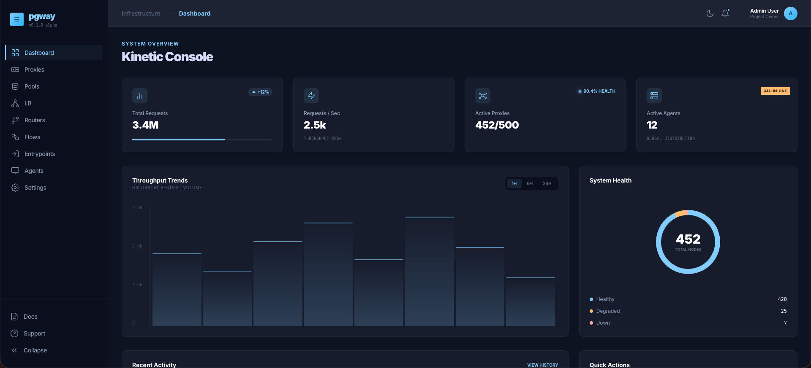

# Dashboard

The web dashboard is **experimental** and **not production-ready**.

It is a Nuxt 4 + Vue 3 + PrimeVue + Vue Flow UI that talks to the Control Plane over **REST**. Expect incomplete flows, breaking API changes, and rough edges.



*Demo / concept mock of the dashboard overview (not a guarantee of shipped UI).*

!!! warning
    Prefer **`pgctl` + gRPC** for real configuration and operations until dashboard auth and APIs stabilize.

    REST authentication is **not** fully enforced yet — do not expose `rest_listen_addr` on untrusted networks.

## Status

| Area | State |
|------|--------|
| Core gateway (CP/DP, CLI, HTTP proxy, balancers) | Usable / tested |
| Dashboard UI | Work in progress ([#21](https://github.com/aknEvrnky/pgway/issues/21)) |
| Dashboard REST endpoints | Work in progress ([#20](https://github.com/aknEvrnky/pgway/issues/20)) |
| Dashboard authentication | Planned ([#22](https://github.com/aknEvrnky/pgway/issues/22)) |

Milestone: [Dashboard](https://github.com/aknEvrnky/pgway/milestones) on GitHub.

## Local UI development (optional)

Only if you are hacking on the frontend. Requires Bun or Node 20+.

```bash
cd frontend
bun install
bun run dev    # http://localhost:3000
```

The all-in-one / CP process must be running with `rest.enabled = true` (default) and `rest.listen_addr` set (default `:8081`) for the UI to reach the API. See [Configuration](../getting-started/configuration.md).

## What to use instead

| Task | Tool |
|------|------|
| Apply / inspect resources | [CLI (`pgctl`)](cli.md) |
| First bootstrap | [First run](../getting-started/first-run.md) |
| Auth & agents | [Authentication](authentication.md) |

## Related

- [Welcome](../index.md) — project-wide experimental notice
- [Binaries & planes](../concepts/binaries.md)
