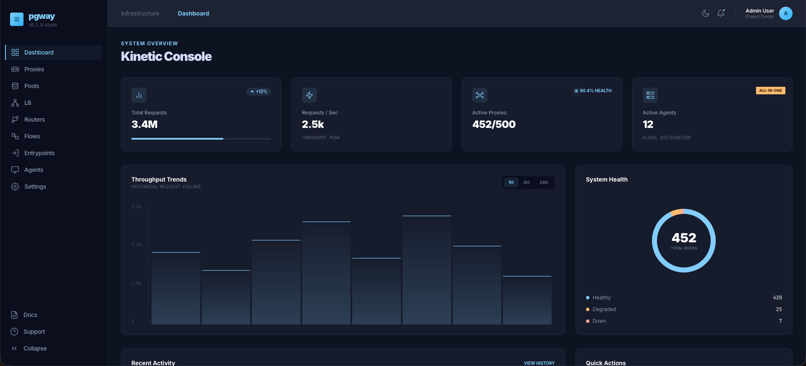

# Dashboard

The web dashboard is **experimental** and **not production-ready**.

It is a Nuxt 4 + Vue 3 + PrimeVue + Vue Flow UI served from the Control Plane over HTTP (JSON under `/api/v1/*`, UI at `/` when embedded). Expect incomplete flows, breaking API changes, and rough edges.



*Demo / concept mock of the dashboard overview (not a guarantee of shipped UI).*

!!! warning
    Prefer **`pgctl` + gRPC** for real configuration and operations until the dashboard matures.

    The dashboard HTTP surface requires a **user** session. Default listen is **loopback** (`127.0.0.1:8081`). Do not bind non-loopback without a trusted network / reverse proxy.

## Using the embedded UI (release / Docker)

Release and Docker images build `pgway` / `pgway-cp` with `-tags embeddashboard` so the static UI is inside the binary.

1. Run with `dashboard.enabled = true` (default) and open **`http://127.0.0.1:8081/`** (same origin as `/api/v1` — no CORS needed).
2. Sign in at `/login` with a CP user (after `pgctl init`).
3. Untagged local `go build` / `make build` binaries have **no** UI; use a release build, `make build-embed`, or the [local UI development](#local-ui-development-optional) workflow below.


## Status

Work is tracked on the [Dashboard](https://github.com/aknEvrnky/pgway/milestones) milestone. Epic: [#21](https://github.com/aknEvrnky/pgway/issues/21).

| Area | State |
|------|--------|
| Core gateway (CP/DP, CLI, HTTP proxy, balancers) | Usable / tested |
| REST auth / secure defaults / rate limit | Done ([#86](https://github.com/aknEvrnky/pgway/issues/86)); coverage ongoing ([#87](https://github.com/aknEvrnky/pgway/issues/87)) |
| Dashboard login page / route guards / API client | Done ([#22](https://github.com/aknEvrnky/pgway/issues/22), [#104](https://github.com/aknEvrnky/pgway/issues/104)) |
| REST Proxy / Pool / LoadBalancer / Router / Flow / Entrypoint CRUD | Done (dashboard resource pages + Flow editor) |
| REST agents list | Done ([#115](https://github.com/aknEvrnky/pgway/issues/115)) — `GET /api/v1/agents` |
| REST users admin API | Done ([#103](https://github.com/aknEvrnky/pgway/issues/103)) — admin-only `/api/v1/users*` |
| Dashboard Proxies / Pools / LB / Routers / Flows / Entrypoints CRUD | Done (slice of [#105](https://github.com/aknEvrnky/pgway/issues/105)) |
| Flow visual editor (Vue Flow) + read-only YAML projection | Done (experimental) |
| Users admin UI (admin-only nav) | Done ([#109](https://github.com/aknEvrnky/pgway/issues/109)) |
| Home agents panel + Agents page (read-only) | Done ([#108](https://github.com/aknEvrnky/pgway/issues/108)) — register/revoke still via pgctl |
| Settings / notifications | Stub / hidden — later |
| Overview charts / live logs / health panels | Later ([#20](https://github.com/aknEvrnky/pgway/issues/20), [#14](https://github.com/aknEvrnky/pgway/issues/14), [#9](https://github.com/aknEvrnky/pgway/issues/9)) |

Milestone: [Dashboard](https://github.com/aknEvrnky/pgway/milestones) on GitHub.

## Local UI development (optional)

Only if you are hacking on the frontend (split process). Requires Bun or Node 20+ / Yarn.

```bash
cd frontend
yarn install   # or: bun install / npm install
yarn dev       # http://localhost:3000
```

The all-in-one / CP process must be running with `dashboard.enabled = true` (default) and `dashboard.listen_addr` reachable (default `127.0.0.1:8081`).

1. Add `http://localhost:3000` to `dashboard.cors_allow_origins` (credentials-enabled CORS).
2. Point the UI at `http://localhost:8081` via `NUXT_PUBLIC_API_BASE` (default) — use **`localhost`**, not `127.0.0.1`, so the httpOnly session cookie stays same-site. Embedded builds set `NUXT_PUBLIC_API_BASE=` (empty) for same-origin relative API calls.
3. Open `/login`, sign in with a CP user (after `pgctl init` / `pgctl login` credentials).
4. Resource pages (same REST filters: `search`, type/protocol chips, cursor pagination via `page_size` / `page_token`):
   - **Proxies** (`/proxies`) — create (URL or manual), edit, delete (blocked while a pool references the proxy).
   - **Pools** (`/pools`) — static members or dynamic `selector.allow`; delete blocked while a load balancer references the pool. Weighted balancers require a static pool.
   - **Load Balancers** (`/load-balancers`) — round-robin, weighted, least-bytes.
   - **Routers** (`/routers`) — ordered match rules → balancer targets.
   - **Flows** (`/flows`) — list + **visual editor** (`/flows/{name}`) for the pipeline graph.
   - **Entrypoints** (`/entrypoints`) — listen host/port bound to a Flow. Detach in the editor deletes the entrypoint (stops the socket); the Flow remains.
   - **Agents** (`/` home panel + `/agents`) — read-only list from `GET /api/v1/agents` (`active` / `passive` / `disconnected`, hostname, version, last heartbeat). Register/revoke still via `pgctl` / gRPC.
   - **Users** (`/users`) — **admin only** (nav + route gate). List / create (`admin` or `member`; empty create password → one-time `generated_password`), delete (last admin blocked), password reset (new password required, same as gRPC). Members never see the nav item; hitting `/users` redirects home.
5. **Settings** and header notifications are hidden until there is something to configure.

### Session & API client

- Login sets an **httpOnly** `pgway_token` cookie (primary) and keeps a same-tab **Bearer** fallback in memory for the token returned by `POST /api/v1/auth/login`. The token is **not** stored in `localStorage`.
- `useApi` sends `credentials: 'include'` and attaches `Authorization: Bearer …` when the in-memory token is present. JSON `{ "error": "…" }` bodies are surfaced as UI messages.
- A **401** on a protected call clears the local session and redirects to `/login` (login / session probe calls opt out of that redirect).
- **Agents (read-only):** `GET /api/v1/agents` — any authenticated user (`admin` / `member`); cursor pagination + `search` like other list endpoints. Status is derived server-side from `agent.heartbeat_threshold`.
- **Admin-only** user management: `GET/POST /api/v1/users`, `DELETE /api/v1/users/{username}`, and `POST /api/v1/users/{username}/password` (self-change: `old_password` + `new_password`; admin reset of another user: `new_password` required). Members receive **403**.

### Flow visual editor

- Canvas shows Entrypoint → Flow → (optional Router) → LoadBalancer → Pool → (static) Proxy.
- Palette: attach existing resources or create new ones; create router/balancer from the editor binds `flow.router_id` / `flow.balancer_id` (Deploy to persist the Flow).
- Sidebar: Node Settings (including unbind router/balancer, detach entrypoint) and a **read-only** multi-doc YAML projection (`kind` / `version` / `metadata` / `spec`, apply-order sorted) compatible with `pgctl apply`. YAML is generated client-side today — not a server export API.
- Dirty tracking + **Deploy Changes** applies staged resources in Proxy → … → Entrypoint order.
- Entrypoints already bound to another Flow cannot be stolen via the attach dialog (UI-only; Control Plane Apply still allows rebind).

See [Authentication](authentication.md) for REST login/logout/me and [Configuration](../getting-started/configuration.md).

## What to use instead

| Task | Tool |
|------|------|
| Apply / inspect resources | [CLI (`pgctl`)](cli.md) |
| First bootstrap | [First run](../getting-started/first-run.md) |
| Auth & agents | [Authentication](authentication.md) |

## Related

- [Welcome](../index.md) — project-wide experimental notice
- [Binaries & planes](../concepts/binaries.md)
- [Entrypoint](../reference/entrypoint.md) · [Flow](../reference/flow.md) · [Load balancing](load-balancing.md)
