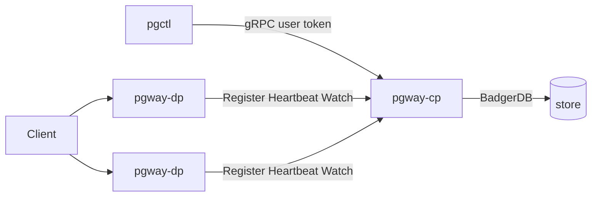

# Distributed mode & operations

Run the Control Plane and Data Plane as **separate processes** when you want config centralised and gateways at the edge (or multiple DPs). Concepts: [Binaries & planes](../concepts/binaries.md). First-time steps: [First run — Path B](../getting-started/first-run.md). Auth: [Authentication](authentication.md).



## When to use it

| Mode | Use when |
|------|----------|
| All-in-one `pgway` | Local dev, single host |
| `pgway-cp` + `pgway-dp` | Separate config host from traffic; multiple agents; clearer blast radius |

All-in-one still uses the same resource model and `pgctl`; it simply skips **agent** registration.

## Topology

1. **CP** listens on `grpc.listen_addr` (and optional experimental REST).
2. Each **DP** dials that address, registers as an agent, heartbeats, and watches config.
3. **Entrypoints** bind on the DP that received the config — clients hit the DP host:port, not the CP.

## Bring-up checklist

```bash
# Terminal 1 — Control Plane
./build/pgway-cp --config ./cp.toml

# Terminal 2 — admin (once)
./build/pgctl init --bootstrap-token 'pgw_…'
./build/pgctl login --username admin

# Terminal 2 — agent registration token (once per new agent)
REG=$(./build/pgctl agent token create)

# Terminal 3 — Data Plane
PGWAY_AGENT_REGISTRATION_TOKEN="$REG" ./build/pgway-dp --config ./dp.toml

# Apply resources (served by DP after Watch/reload)
./build/pgctl apply -f stack.yaml
./build/pgctl agent list
```

### Example configs

```toml
# cp.toml
log_level = "info"

[badger]
path = "./var/cp-lib"

[grpc]
listen_addr = ":9090"

[rest]
listen_addr = ":8081"
```

```toml
# dp.toml — grpc.listen_addr is the CP to dial
log_level = "info"

[grpc]
listen_addr = "127.0.0.1:9090"

[agent]
name = "edge-1"
labels = { zone = "edge" }
state_path = "./var/agent-edge-1.json"
heartbeat_interval = "10s"
```

Later DP starts reuse `agent.state_path` (no registration token).

## Hot reload / Watch

- Applying or deleting resources on the CP emits change events.
- **All-in-one:** in-process consumer rebuilds entrypoints / balancers.
- **Distributed:** agents subscribe over gRPC **Watch**; the DP refreshes its in-memory view without requiring you to re-register.

Balancer internal state (RR cursor, least-bytes counters, weighted currents) resets when that balancer instance is rebuilt.

## Agent lifecycle

| Event | Effect |
|-------|--------|
| Successful Register | Credentials written to `agent.state_path`; status → active (with heartbeats) |
| Heartbeat | Extends sliding `auth.agent_token_ttl`; keeps **active** within `agent.heartbeat_threshold` |
| Graceful DP shutdown | Deregister → **passive** |
| Missed heartbeats | **disconnected** |
| `pgctl agent delete <name>` | Credentials revoked; row removed — need a **new** registration token to join again |

```bash
./build/pgctl agent list
./build/pgctl agent delete edge-1
```

## Operations tips

- Give each agent a stable unique `agent.name` and its own `agent.state_path`.
- Point every `pgctl` and DP at the same CP `grpc.listen_addr` (host reachable from that machine).
- Prefer `PGWAY_AGENT_REGISTRATION_TOKEN` / `PGWAY_TOKEN` over committing secrets in TOML.
- Entrypoint `host:port` is local to the **DP** process — open firewalls accordingly.
- Label-based DP placement ([#46](https://github.com/aknEvrnky/pgway/issues/46)) and mTLS CP↔DP ([#47](https://github.com/aknEvrnky/pgway/issues/47)) are still open.

## Troubleshooting

| Symptom | Checks |
|---------|--------|
| DP exits: no agent state / empty registration token | First start needs `PGWAY_AGENT_REGISTRATION_TOKEN` or a populated `agent.state_path` |
| `agent list` shows disconnected | Network to CP, `agent.heartbeat_interval` vs threshold, CP uptime |
| Apply OK but no listener | Confirm DP is running and Watch connected; look for entrypoint bind logs on **DP**, not CP |
| `pgctl` auth errors | `pgctl login`; `PGWAY_GRPC_LISTEN_ADDR`; not mixing agent token with user commands |
| Restarted CP before init | Bootstrap token rotated — use the new log value |

## Related

- [First run](../getting-started/first-run.md)
- [Authentication](authentication.md)
- [Configuration](../getting-started/configuration.md)
- [CLI](cli.md)
