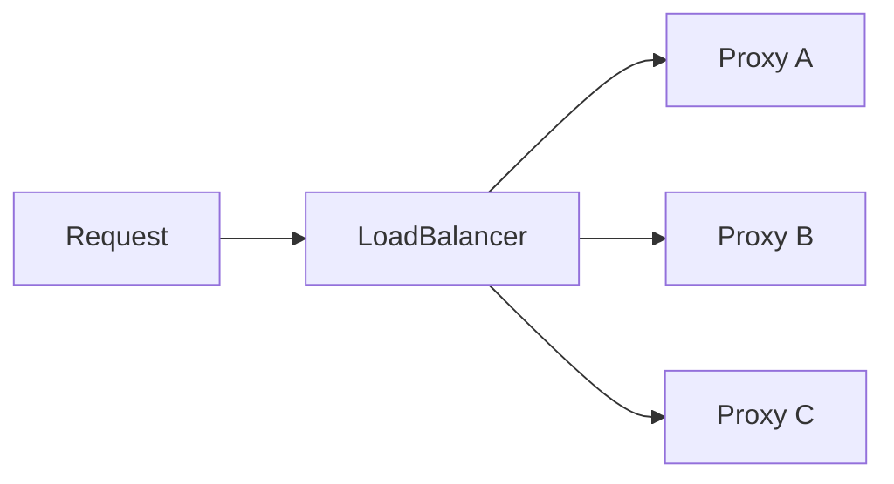

# Load balancing

Every pool sits behind a **LoadBalancer**. The balancer picks which resolved proxy handles the next request. YAML field reference: [LoadBalancer](../reference/loadbalancer.md) · pool membership: [Pool](../reference/pool.md).



## Strategies at a glance

| `type` | Selects | Pool | Extra config |
|--------|---------|------|--------------|
| `round-robin` | Next proxy in rotation | Static or dynamic | — |
| `weighted` | Smooth WRR by member weight | **Static only** | Weights on `pool.members` |
| `least-bytes` | Proxy with lowest accumulated downstream bytes | Static or dynamic | Optional `reset_interval` (default `1m`) |

## Round-robin

Even distribution across whatever the pool currently resolves to. Works with dynamic pools (membership can change as labeled proxies appear/disappear).

```yaml
kind: LoadBalancer
version: v1
metadata:
  name: main-rr
spec:
  type: round-robin
  pool_id: dynamic-pool
```

`Release` is a no-op for this strategy — no per-request feedback is needed.

## Weighted

Nginx-style **smooth weighted round-robin**: traffic approximates weight ratios without long bursts on the heavy member.

- Weights live on the **static pool**, not on the balancer:

```yaml
kind: Pool
version: v1
metadata:
  name: static-pool
spec:
  type: static
  members:
    - proxy_id: proxy-1
      weight: 3
    - proxy_id: proxy-2
      # weight omit → 1
---
kind: LoadBalancer
version: v1
metadata:
  name: main-weighted
spec:
  type: weighted
  pool_id: static-pool
```

- `weight` must be **≥ 1** if set; default **1**.
- Apply **rejects** `type: weighted` when `pool_id` points at a dynamic pool.
- You cannot convert that pool to dynamic while a weighted balancer still references it.

`Release` is unused.

## Least-bytes

Routes to the proxy with the **fewest accumulated downstream bytes** so far.

```yaml
kind: LoadBalancer
version: v1
metadata:
  name: main-least-bytes
spec:
  type: least-bytes
  pool_id: dynamic-pool
  reset_interval: 1m   # optional
```

### What is counted?

| Path | Counted |
|------|---------|
| HTTP response body → client | Yes |
| CONNECT tunnel **upstream → client** | Yes |
| Request body / client → upstream | No |

Bytes are reported when the request finishes via the balancer `Release` hook (handler measures `io.Copy` into the client).

### Timing model

- Counters update **only on `Release`** (after the transfer ends). Long-lived tunnels do not publish mid-flight totals yet.
- **In-flight** byte estimates are intentionally out of scope for now.
- On tie (equal counters), the **lowest index** among current resolved proxies wins.

### Reset

- `reset_interval` is a Go duration (`30s`, `1m`, …). Only valid on `least-bytes`.
- Default when omitted: **`1m`**.
- Reset is **lazy**: counters clear on the next `Next()` after the interval has elapsed (no background ticker).

### Measuring tip

`curl -I` (HEAD) often transfers little body data — poor for verifying least-bytes. Prefer full downloads:

```bash
curl -x http://localhost:8080 -o /dev/null https://httpbin.org/bytes/8192
```

## Choosing a strategy

| Goal | Prefer |
|------|--------|
| Simple even spread; dynamic labels | `round-robin` |
| Some proxies should take more share | `weighted` + static pool |
| Prefer less-loaded links by transferred volume | `least-bytes` |

Use a **Router** to send different traffic classes to different balancers (e.g. `.weighted.local` → weighted, `.bytes.local` → least-bytes). See [Router](../reference/router.md).

## Runtime notes

- Selection runs on the **Data Plane** hot path against an in-memory balancer instance.
- Config Watch / rebuild replaces the instance (state such as RR cursor or least-bytes counters resets on rebuild).
- Empty resolved proxy list → request fails (no proxy available).

## Related

- [LoadBalancer reference](../reference/loadbalancer.md)
- [Pool reference](../reference/pool.md)
- [Resources & flow model](../concepts/resources.md)
