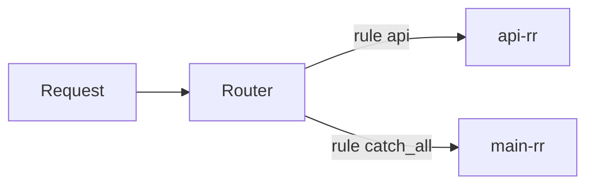

# Routing

The optional **Router** sits on a Flow and picks a **LoadBalancer** per request. Rules run **top to bottom**; the first match wins. Field reference: [Router](../reference/router.md).



Without a router, the Flow’s `balancer_id` handles everything.

## Attach a router

```yaml
kind: Flow
version: v1
metadata:
  name: main-flow
spec:
  router_id: main-router
  balancer_id: main-rr   # ignored at runtime while router_id is set
```

Each rule `target` must be an existing LoadBalancer `metadata.name`.

## Evaluation order

1. Evaluate `rules[0]`, then `rules[1]`, …
2. Stop at the first matching rule; use its `target`.
3. If nothing matches, routing fails — always end with a `catch_all` (or an equivalent that covers residual traffic) unless you intentionally want hard failures.

## Match types (behaviour)

| Type | `value` | Notes |
|------|---------|--------|
| `host` | glob | Hostname only (**port stripped**); `filepath.Match` style, e.g. `*.cdn.example.com` |
| `host_suffix` | suffix | Host ends with value; port stripped; leading `.` normalized |
| `path_prefix` | prefix | `URL.Path` prefix, e.g. `/api/` |
| `path_regex` | regex | Full regex against path |
| `method` | method | Case-insensitive HTTP method |
| `header` | `Name:Value` | Split on the **first** `:`; exact header value |
| `catch_all` | *(omit)* | Always true |

Composites:

| Form | Meaning |
|------|---------|
| `all: […]` | AND — every condition must match |
| `any: […]` | OR — at least one matches |
| `not: {…}` | Negate one condition (must combine with `type` / `all` / `any`) |

## Examples

### Host suffix + default

```yaml
kind: Router
version: v1
metadata:
  name: main-router
spec:
  title: Split by host
  rules:
    - id: weighted-host
      match:
        type: host_suffix
        value: .weighted.local
      target: main-weighted
    - id: bytes-host
      match:
        type: host_suffix
        value: .bytes.local
      target: main-least-bytes
    - id: catch-all
      match:
        type: catch_all
      target: main-rr
```

Traffic to `foo.weighted.local` → weighted balancer; everything else → round-robin.

### Path and method

```yaml
rules:
  - id: api-posts
    match:
      all:
        - type: method
          value: POST
        - type: path_prefix
          value: /v1/
    target: api-rr
  - id: catch-all
    match:
      type: catch_all
    target: main-rr
```

### Header region

```yaml
rules:
  - id: de
    match:
      type: header
      value: "X-Region:de"
    target: de-rr
  - id: catch-all
    match:
      type: catch_all
    target: main-rr
```

### Any CDN host, skip OPTIONS

```yaml
rules:
  - id: cdn-get
    match:
      any:
        - type: host
          value: "*.cdn.example.com"
        - type: path_prefix
          value: /static/
      not:
        type: method
        value: OPTIONS
    target: cdn-rr
  - id: catch-all
    match:
      type: catch_all
    target: main-rr
```

## Design tips

- Put **specific** rules first, `catch_all` last.
- Prefer `host_suffix` for multi-tenant host routing; use `host` globs when you need wildcards in the middle/left.
- Keep targets as separate balancers when strategies or pools differ ([Load balancing](load-balancing.md)).
- Router does not see pool members — only balancer names.

## Related

- [Router reference](../reference/router.md)
- [Flow reference](../reference/flow.md)
- [Resources & flow model](../concepts/resources.md)
