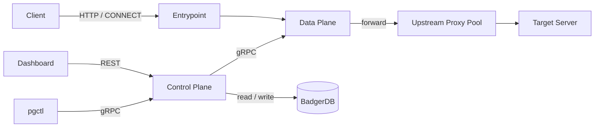
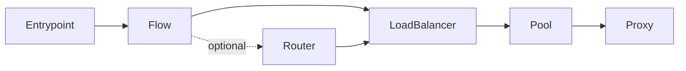

# Welcome

**pgway** is a proxy gateway for managing HTTP and SOCKS5 upstream proxies through a single, stable entry point. You register proxies from your providers; clients always talk to pgway. When upstream URLs change, the entry point stays the same.

```text
Client → pgway (Gateway) → Upstream Proxy Pool → Target Server
```

!!! warning "Experimental"
    pgway is under active development. The **core gateway** (Control Plane, Data Plane, CLI, HTTP proxying, routing, and load balancing) is working and covered by tests.

    The **web dashboard** and its **REST API** are **not production-ready**. Expect breaking changes, incomplete flows, and rough edges. Prefer `pgctl` and gRPC for real configuration work until the dashboard matures.

## Why pgway?

Upstream proxy providers rotate endpoints and credentials often. pgway gives you:

- One fixed listen address for your apps and scrapers
- Declarative pools, routers, and load balancers
- A split between **Control Plane** (config) and **Data Plane** (traffic), so you can run all-in-one or distributed agents

## What works today

| Area | Status |
|------|--------|
| HTTP proxy + CONNECT tunneling | Ready |
| SOCKS5 upstream proxies (client entrypoint remains HTTP) | Ready |
| Entrypoint → Flow → (optional Router) → LoadBalancer → Pool → Proxy | Ready |
| Static and dynamic (label-selector) pools | Ready |
| Load balancing: round-robin, weighted, least-bytes | Ready |
| Router rules (host, path, method, header, composites) | Ready |
| Control Plane / Data Plane over gRPC | Ready |
| Agent registration, heartbeat, config Watch / hot reload | Ready |
| CLI (`pgctl`) for apply / get / delete | Ready |
| Token auth + user management on gRPC | Ready |
| BadgerDB-backed config store | Ready |
| Web dashboard (Nuxt) + REST surface | Experimental — not ready |
| Health checks / auto pool recovery | Planned |
| Metrics / OpenTelemetry | Planned |

### Binaries

| Binary | Role |
|--------|------|
| `pgway` | All-in-one: Control Plane + Data Plane |
| `pgway-cp` | Standalone Control Plane |
| `pgway-dp` | Standalone Data Plane (agent) |
| `pgctl` | CLI against the Control Plane |

## Architecture at a glance

The Control Plane owns configuration (BadgerDB) and exposes gRPC + REST. The Data Plane serves traffic on entrypoints. In single-process mode they share memory; in distributed mode agents register, heartbeat, and receive config updates over gRPC.



Resources form a pipeline. A minimal valid path is **Entrypoint → LoadBalancer → Pool → Proxy**. Multiple entrypoints can listen on different ports in the same process.



- **Entrypoint** — required start of the pipeline (host:port listener)
- **Router** — optional; matches on host / path / method / header and picks a target balancer
- **LoadBalancer** — required; sits in front of exactly one pool
- **Pool** — group of proxies (static list or dynamic label selector)
- **Proxy** — single upstream proxy (HTTP or SOCKS5)

## Roadmap

Work is organized around GitHub milestones. High-level direction:

1. **API foundation** — domain/API polish for dashboard consumers (largely done; leftover test updates remain).
2. **CP ↔ DP communication** — agent auth, hot reload, and balancers are largely in place. Still open: **proxy health**, **label-based DP placement**, **mTLS** between CP and DP.
3. **Observability** — OpenTelemetry, live log streaming, audit / recent activity.
4. **Production readiness** — Docker images, goreleaser / multi-platform distribution, CI build matrix.
5. **Dashboard** — dedicated Nuxt admin UI and REST endpoints; **explicitly experimental** until these issues land.

Other near-term product goals (from the main project README): Prometheus-style metrics, health checks with automatic pool recovery, and proper auth for REST / dashboard.

Smaller open items (DNS cache, REST rate limits, etc.) live as optimization issues on GitHub and will be tackled as capacity allows.

## This documentation site

These docs are a separate home for:

- Motivation and current status ([Welcome](index.md))
- Concepts and the resource pipeline ([Resources & flow model](concepts/resources.md), [Binaries & planes](concepts/binaries.md))
- How to run and operate pgway ([Installation](getting-started/installation.md), [Configuration](getting-started/configuration.md), [First run](getting-started/first-run.md))
- Resource YAML reference ([Overview](reference/index.md))
- Guides ([Authentication](guides/authentication.md), [Load balancing](guides/load-balancing.md), [Routing](guides/routing.md), [CLI](guides/cli.md), [Distributed mode](guides/distributed.md), [Dashboard](guides/dashboard.md))

The source code and issue tracker remain at [github.com/aknEvrnky/pgway](https://github.com/aknEvrnky/pgway).

## License

pgway is released under the [Apache License 2.0](https://github.com/aknEvrnky/pgway/blob/main/LICENSE).
