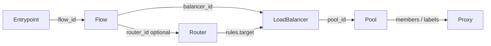

# Resource reference

Declarative resources applied with `pgctl apply -f …`. Each document is a YAML object with a shared envelope and a kind-specific `spec`.

## Envelope

| Field | Required | Description |
|-------|----------|-------------|
| `kind` | yes | Resource type (see below) |
| `version` | yes | API version — currently `v1` |
| `metadata` | — | Identity and labels |
| `spec` | — | Kind-specific fields |

### `metadata`

| Field | Required | Description |
|-------|----------|-------------|
| `name` | no* | Resource ID. If omitted, a ULID is generated on apply |
| `labels` | no | `map[string]string` — used by dynamic pools and placement |

\*Prefer an explicit `name` so stacks stay referencable (`pool_id`, `flow_id`, …).

## Kinds

| Kind | Page |
|------|------|
| `Proxy` | [Proxy](proxy.md) |
| `Pool` | [Pool](pool.md) |
| `LoadBalancer` | [LoadBalancer](loadbalancer.md) |
| `Router` | [Router](router.md) |
| `Flow` | [Flow](flow.md) |
| `Entrypoint` | [Entrypoint](entrypoint.md) |

## How they connect

Mental model: [Resources & flow model](../concepts/resources.md).
